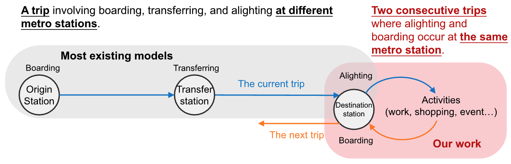

A blog for the paper: "[Abnormal metro passenger demand is predictable from alighting and boarding correlation](https://www.sciencedirect.com/science/article/pii/S0968090X25002438)" published in *Transportation Research Part C: Emerging Technologies*.

**Short summary**: Certain abnormal metro passenger demand during special events (e.g., concerts, games) can be predicted by the alighting and boarding correlation without using external data. A method called ABTransformer is proposed to leverage this correlation for abnormal demand forecasting.

## What is Alighting-Boarding Correlation?

In chained travel, a passenger who alights at a station is highly likely to **return and board again from the same station** after completing an intermediate activity (e.g., work, event, or shopping)[^1]. This behavior induces a **predictable, time-lagged correlation** between the alighting and boarding demand at that station.

  

<em>Figure 1. AB correlation occurs between two consecutive trips at the same station.</em>

- The AB correlation forms long-range temporal dependencies, often spanning hours.
- These dependencies are especially prominent during events like concerts or games, allowing early warning of future boarding surges.
- AB correlation is station-specific, rather than network-wide.

## ABTransformer
Alighting-Boarding Transformer (ABTransformer) is a method proposed in the paper, that leverages attention mechanisms to model Alighting-Boarding Correlation for forecasting metro boarding demand, especially during abnormal events. The model architecture is shown in Figure 2.

  

<em>Figure 2. The architecture of ABTransformer.</em>

Figure 3 shows an example of forecasting the abnormal boarding demand during a special event at a metro station in Guangzhou, China. We can see the forecasting (in green line) accurately reflects the surge in boarding demand (in blue line) at around 22:00. ABTransformer separately processes Alighting and Boarding data, preserving the **interpretability** of attention weights.  During an special event, the boarding demand forecast exhibits significant attention to time periods with abnormal alighting demand.

  

<em>Figure 3. The attention weights highlight parts of the input sequence that contribute to the forecast at the checked location. During an special event, the boarding demand forecast exhibits significant attention to time periods with abnormal alighting demand.</em>

## Behind the Paper

The very first experiment results back in May 2023 were very promising (ABTransformer can predict the abnormal demand, and attention weights in Figure 3 shown interpretable results). However, the finishing of the paper took much longer than expected. Here are some of my reflections on the process:

It would be much easier if I did not tune the benchmark models too much. After this and another similar work that has many benchmarks, I realized that different deep learning models, as long as you use them properly, can achieve similar performance. I would not say that using a Transformer is more accurate than using RNNs in time series forecasting (perhaps more interpretable). Reading too many papers misled me to believe that Transformers should be significantly better than RNNs[^2]. A paper should have more general insights rather than just showing a new model is better than others.

Finally, I want to say that the most important thing in this work is not the ABTransformer model itself, but the importance of AB correlation for normal and abnormal demand forecasting. I hope this idea can inspire more research in the future.

[^1]: This is called the "returning flow" behavior in the literature. See: Cheng, Z., Trépanier, M., & Sun, L. (2021). [Incorporating travel behavior regularity into passenger flow forecasting](https://doi.org/10.1016/j.trc.2021.103200). Transportation Research Part C: Emerging Technologies, 128, 103200.
[^2]: I echo with the talk “[Fundamental Limitations of Foundational Forecasting Models: The Need for Multimodality and Rigorous Evaluation](https://cbergmeir.com/talks/neurips2024/)" by Christoph Bergmeir. 2024.

‌